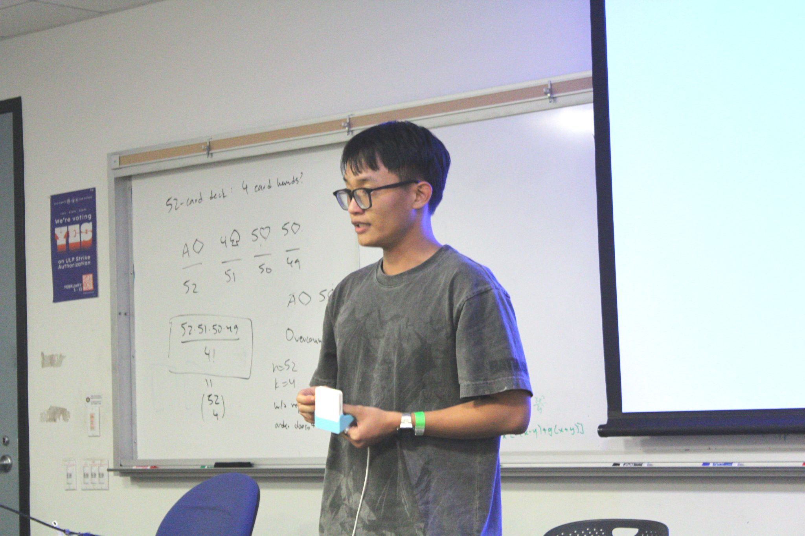
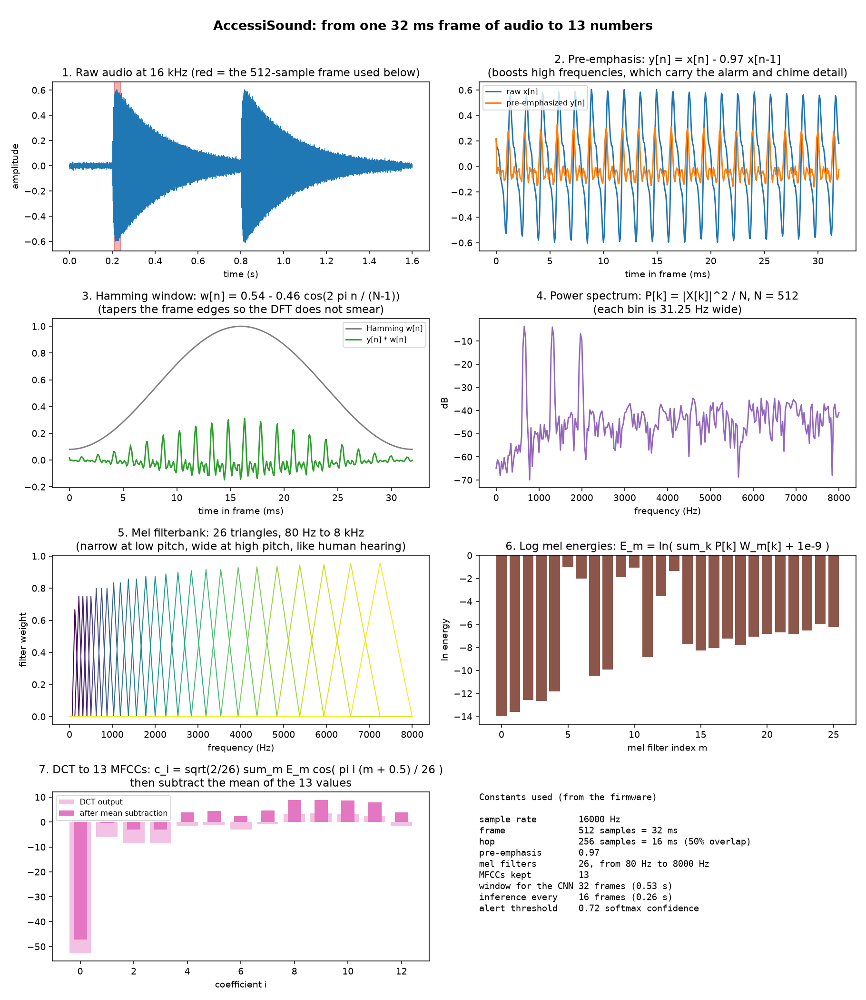
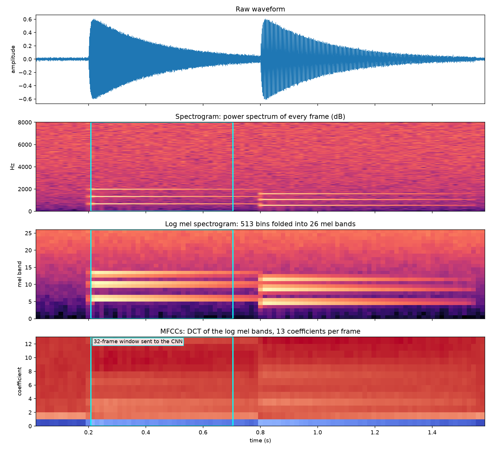
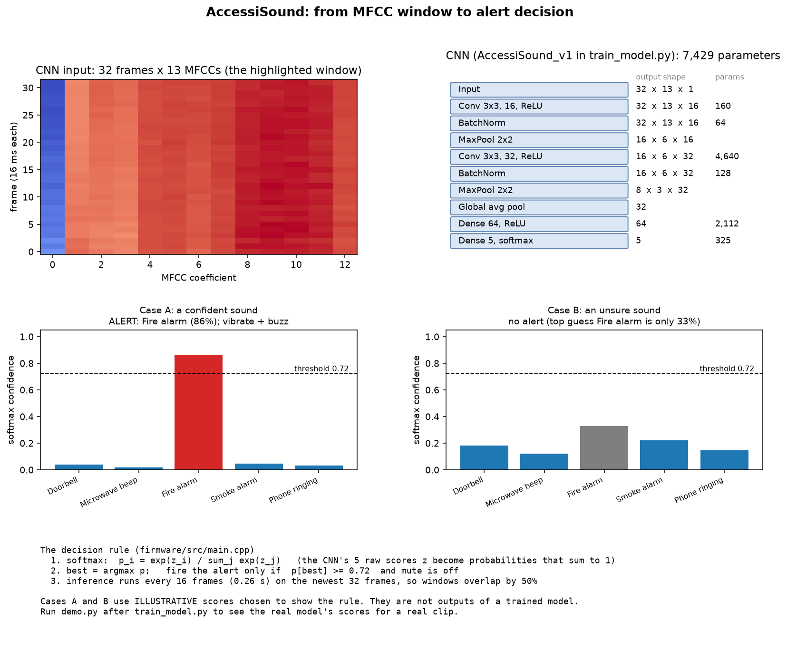
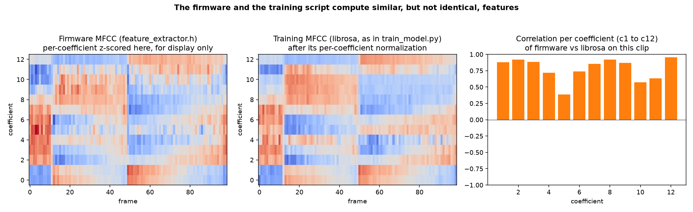

# AccessiSound

An assistive device built around an ESP32-S3 that listens to the room,
recognizes sounds, and tells the user about them. It has three real
versions, described below. This repo holds the sound-recognition code, the
hardware documentation and a 3D model of the v2 enclosure.

| Version | What it was | Hardware |
|---|---|---|
| **v1** | Hackathon prototype, SoDA Hacks, March 7, 2026 | ESP32-S3-BOX-3 dev kit (borrowed) |
| **v2** | Rebuilt at home with my own parts and a custom enclosure | ESP32-S3 dev board, ESP32-CAM, 1.54 inch display |
| **v2.5** | Gift version built for a friend | v2 plus kitchen object recognition and a mochi animation |

## v1: the hackathon prototype

Built at SoDA Hacks, UC Berkeley, on Saturday, March 7, 2026. It ran on an
ESP32-S3-BOX-3, an off-the-shelf Espressif dev kit
([espressif/esp-box](https://github.com/espressif/esp-box)) that CSUA (the
Computer Science Undergraduate Association at my school) lent out for the
hackathon. I did not design or build an enclosure for v1. Its physical form
is the BOX-3 as sold, not something I made.

> It was my first hackathon, and I learned a lot from both the experience and the people I met there. I built an assistive device using an ESP32-S3 that could recognize speech and surrounding sounds, then provide real-time descriptions to support accessibility. I also trained the system using basic inputs, online datasets, and CSUA HPC resources.



*Presenting v1 at SoDA Hacks, holding the ESP32-S3-BOX-3.*

## v2: rebuilt at home

After the hackathon I bought my own ESP32 board and components and rebuilt
it as a custom device. Most parts came from AliExpress, but that seller is
gone. The display is a 1.54 inch full color TFT, 240 x 240 pixels, ST7789
driver, SPI interface, 3.3 V, 65K colors. An equivalent part is on Amazon:
[B0GVYMJVWH](https://www.amazon.com/dp/B0GVYMJVWH). Everything else was
generic online parts.

Components:

- ESP32-S3 dev board (the repo firmware targets the ESP32-S3-DevKitC-1)
- ESP32-CAM module
- 1.54 inch ST7789 SPI display (above)
- INMP441 I2S microphone
- USB-C charging circuit (TP4056 class module) and a small LiPo battery
- Vibration motor, buzzer and two status LEDs, as in the original parts list

I imitated the look of the ESP32-S3-BOX-3, but the finished enclosure ended
up looking like a vintage Macintosh 128K.

Even though there is no photo of the physical v2 unit, the picture below
accurately represents the model made using Autodesk Fusion.


Model files, parts list with dimensions, wiring tables and print notes are
in [hardware/v2](hardware/v2/README.md):

- [Fusion 360 archive (.f3d)](hardware/v2/accessisound_v2_assembly.f3d) and [STEP](hardware/v2/accessisound_v2_assembly.step)
- STL files for the [front shell](hardware/v2/stl/enclosure_front.stl), [back shell](hardware/v2/stl/enclosure_back.stl), [mounting plate](hardware/v2/stl/mount_plate.stl), and one [build-plate layout](hardware/v2/stl/print_plate_layout.stl)

## v2.5: the gift version

I built this while moving out of the dorm for summer break. I adapted the
v1 to v2 design for a friend's needs: his family has hearing and visual
impairments. I added kitchen object recognition through the ESP32-CAM and a
cute mochi character animation on the display to make it feel friendlier.
I gave it to him as a thank you for helping me brainstorm the original
hackathon idea. He still uses it every day in his dorm kitchen.

This device used to be listed separately on my resume and site as "AI
Kitchen Accessibility Assistant". It is the same device, not a separate
project.

The camera and animation code is not in this repo yet. What is here is the
sound-recognition pipeline described next.

## How the sound recognition works

The device listens through a microphone, turns each 32 ms slice of audio
into 13 numbers (MFCCs), stacks 32 slices into a 0.53 second window, and
runs a small CNN over it. If the top guess is at least 72 percent
confident, it fires an alert. Everything runs on the ESP32-S3: no phone,
no cloud.

`ml/visualize_pipeline.py` draws every step using the firmware's own math,
rewritten in NumPy. It needs only numpy, scipy and matplotlib, no dataset
and no hardware:

```bash
cd ml
pip install numpy scipy matplotlib
python visualize_pipeline.py            # built-in synthetic chime, or pass a WAV
python check_against_firmware.py        # optional: compiles the real firmware code with g++ and compares
```

The check compiles `firmware/src/feature_extractor.h` and compares it to the
NumPy version on real frames. They agree to about 3e-5, which is float32
rounding.

**1. One frame of audio to 13 numbers.** Pre-emphasis, Hamming window, power
spectrum, 26 mel filters, log, DCT.



**2. The whole clip.** Spectrogram, then mel bands, then MFCCs. The cyan box
is the 32-frame window the CNN sees.



**3. From MFCC window to alert.** The CNN (7,429 parameters), softmax, and
the 0.72 rule from `firmware/src/main.cpp`. The two example score sets in
this figure are illustrations of the rule, not outputs of a trained model.



**4. Firmware versus training features.** The firmware and `train_model.py`
do not compute identical MFCCs, see the known issues below.



## Try the ML without hardware

```bash
git clone https://github.com/jackpham-rgb/accessisound-esp32s3.git
cd accessisound-esp32s3/ml
python -m venv .venv
source .venv/bin/activate      # or .venv\Scripts\activate on Windows
pip install -r requirements.txt
python train_model.py          # downloads ESC-50 (about 600 MB, one time), trains, exports
python demo.py                 # runs a random clip through the trained model
```

Quick check that the pipeline runs: `python train_model.py --skip-download --epochs 5`.

Training writes `models/sound_classifier.tflite`, `models/sound_model.h` (also
copied to `firmware/src/`) and `models/training_report.png`. Test accuracy on
this dataset is about 47 to 53 percent across 5 classes (chance is 20).
ESC-50 has no doorbell, smoke alarm or phone ring, so each class is trained
on the closest stand-in sound; see `TARGET_CLASSES` in `train_model.py`. To
train on real recordings, put 20 to 40 five-second WAV clips per sound in
`data/custom/<class_name>/`, add the folder to `TARGET_CLASSES`, and
re-run.

## Flash the firmware

The firmware in `firmware/` targets an ESP32-S3-DevKitC-1 with an INMP441
microphone, a vibration motor, a buzzer and two LEDs. Wiring for those is
in [hardware/v2](hardware/v2/README.md#wiring). Install
[PlatformIO](https://platformio.org/), then:

```bash
cd firmware
pio run --target upload --upload-port /dev/ttyUSB0   # or COM3 on Windows
pio device monitor
```

## Repository layout

```
firmware/        ESP32-S3 sound-recognition firmware (PlatformIO)
ml/              training, hardware-free demo, algorithm visualization
hardware/v2/     3D model, STL files, parts, wiring
docs/imgs/       algorithm figures
photos/          v1 presentation photo, v2 model renders
```

## Known issues and limits

- **Firmware and training use different features.** `train_model.py` uses
  librosa's MFCC, squeezes a whole 5 second clip into 32 frames, and
  normalizes each coefficient over time. The firmware adds pre-emphasis,
  starts its mel filters at 80 Hz, feeds 32 consecutive 16 ms frames (0.53
  s), and subtracts the mean across the 13 coefficients. On the same audio
  the two agree only partly (mean correlation 0.78, worst coefficient 0.39;
  figure 4). A model trained by this script and run by this firmware has
  never been checked end to end. This is the first thing to fix.
- **Accuracy is measured on stand-in sounds** (above), not on the real
  target sounds.
- **The sound classifier has no "background" class.** It always picks one
  of 5 sounds, so the 0.72 confidence threshold is the only thing stopping
  false alerts.
- **This repo does not contain the speech recognition, camera, display or
  mochi animation code** mentioned in the version notes.
- **The 3D model is a reconstruction.** Dimensions marked "assumed" in
  [hardware/v2](hardware/v2/README.md) need to be measured on real parts
  before printing.

## License

Code: MIT, see [LICENSE](LICENSE). The [ESC-50 dataset](https://github.com/karolpiczak/ESC-50)
used for training is CC-BY, separately from this repo's code.

## Credits

- [ESC-50](https://github.com/karolpiczak/ESC-50) dataset by Karol Piczak
- [TensorFlow Lite for Microcontrollers](https://www.tensorflow.org/lite/microcontrollers)
- [librosa](https://librosa.org/)
- [Espressif ESP-BOX](https://github.com/espressif/esp-box), the v1 hardware
