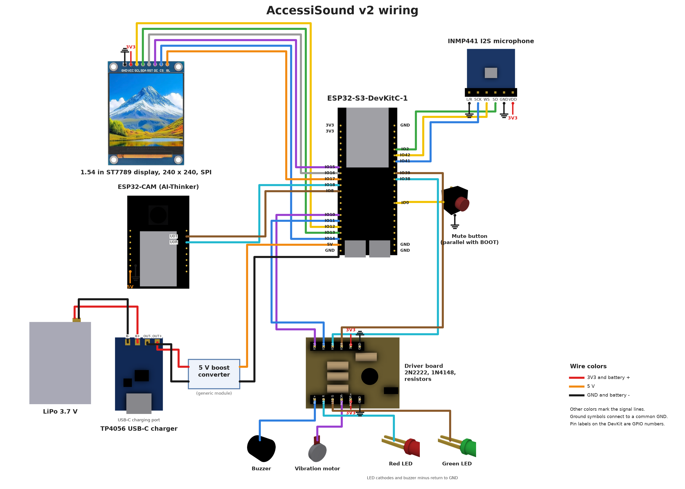

# AccessiSound v2: enclosure, layout and wiring

This folder holds the CAD model of the v2 device: a custom enclosure in the
proportions of a vintage Macintosh 128K, with the boards laid out inside and
every wire drawn. The original v2 design files were lost with the laptop they
lived on, so the model was rebuilt in Autodesk Fusion from the repo docs, the
build description and published component dimensions. It has not been printed
or assembled.


## Wiring diagram



The diagram shows every connection in the build. Wire colors follow the key
at the bottom right: red for 3V3 and battery plus, orange for 5 V, black for
ground, and other colors for individual signal lines. Ground symbols join a
common GND. The labels on the ESP32-S3 header are GPIO numbers.

- **Display (top left).** The six SPI signals go from the display header to
  GPIO 12 (SCL), 13 (SDA), 16 (RST), 15 (DC), 14 (CS) and 17 (BL). The display
  also takes 3V3 and ground.
- **ESP32-CAM.** A two-wire serial link: the DevKit's GPIO 18 goes to the
  camera's U0R and GPIO 8 to U0T. The camera runs from 5 V.
- **Microphone (top right).** The INMP441 uses three I2S lines: SD to GPIO 2,
  WS to GPIO 42 and SCK to GPIO 41. VDD is 3V3, and GND and L/R are grounded
  so the mic reports on the left channel.
- **Mute button.** Wired to GPIO 0, in parallel with the DevKit's BOOT button.
- **Driver board (bottom centre).** GPIO 10, 11, 38 and 39 switch the
  vibration motor (through a 2N2222), the buzzer, and the red and green LEDs.
- **Power (bottom left).** The LiPo connects to the TP4056 USB-C charger, whose
  output goes through a 5 V boost converter to the DevKit's 5V and GND pins.

The display is a photo of the actual module. The other parts are renders from
the Fusion model, drawn at their real proportions so the pins line up with the
header positions. The generator script and part images are in
[diagram/](diagram/); replacing a render with a product photo only needs a new
image and its pin positions in `parts.json`.

## Files

| File | What it is |
|---|---|
| `accessisound_v2_assembly.f3d` | Fusion 360 archive: the full assembly, one component per part, editable |
| `accessisound_v2_assembly.step` | Same assembly as STEP, for any other CAD program |
| `stl/enclosure_front.stl` | Front shell, posed face down for printing |
| `stl/enclosure_back.stl` | Back shell, posed open side down for printing |
| `stl/mount_plate.stl` | Internal mounting plate |
| `stl/print_plate_layout.stl` | All three parts arranged on one build plate (251 x 116 mm, fits a 256 mm bed) |
| `wiring_diagram.png` | The wiring diagram above |
| `diagram/` | Script and part images that generate the diagram |

All STL files are in millimetres and were checked to be closed solids (no
open or shared edges). Supports are needed for the back shell and the plate.
The files have not been test printed. The shells meet at a butt joint with a
2 mm alignment lip on the back shell; glue them, or add screw bosses.

## Size and layout

Outside: 82 wide x 116 tall x 64 deep mm. Front face on the left of the
diagram, parts stacked front to back:

```
front wall 2.4 | display + camera + mic | wire zone | DevKit | plate | battery + charger
```

- Front wall: recessed dark bezel, display window, camera window (top left),
  mic port (top right), buzzer grille, two status LED holes, a decorative
  floppy-style slot, and a mute button hole in the right wall.
- Bottom wall: USB-C openings for the DevKit (flashing) and the charger.
- Back shell: side vents and a sloped rear like the Mac 128K.
- Mounting plate: side blocks that locate the DevKit, pockets for the
  charger, battery and driver board, two strap slots and two wire slots.

## Parts and dimensions

The "Source" column says where each size comes from. Values marked typical
are common figures for that class of part and should be measured on the
actual part before printing.

| Part | Size used (mm) | Source |
|---|---|---|
| ESP32-S3-DevKitC-1 v1.1 | 25.4 x 62.86 board | Espressif's official DXF (`dl.espressif.com/dl/schematics/esp_idf/DXF_ESP32-S3-DevKitC-1_V1.1_20220429.dxf`). Third-party pages round this to 70 x 28. Header pitch 2.54; row spacing about 22.7 to 22.9 (0.9 in nominal), 22 pins each. Board thickness 1.6 and module height 3.1 are typical. |
| ESP32-CAM (AI-Thinker) | 40.5 x 27 x 4.5 board | Two independent listings. Lens position and lens height above the board (5) are typical. |
| 1.54 inch TFT, 240x240, ST7789 | PCB 43.5 x 32, glass 31.7 x 34.3 | Measured from product photos of the module (Amazon listing B0GVYMJVWH). Thickness (glass 2.6 + PCB 1.0) is typical. The active area is 27.72 mm square, from the 1.54 inch diagonal. |
| INMP441 microphone board | 14 x 14 | Typical |
| TP4056 charger, USB-C | 26 x 17 | Typical module size |
| LiPo cell | 40 x 30 x 6 (a 603040 class cell) | Typical, actual cell varies |
| Passive buzzer | 12 dia x 9.5 | Typical |
| Coin vibration motor | 10 dia x 2.7 | Typical |
| 3 mm LEDs, 6 mm tact switch | standard | Standard |

## Wiring tables

The diagram above is drawn from these tables. Wires in the 3D model are
illustrative routes, each on its own depth plane, not a routed harness.

### A. Pins used by `firmware/src/main.cpp`

| From | To |
|---|---|
| Mic WS | GPIO 42 |
| Mic SCK | GPIO 41 |
| Mic SD | GPIO 2 |
| Mic VDD | 3V3 |
| Mic GND, mic L/R | GND (L/R low = left channel, which the firmware reads) |
| GPIO 10 | 1 kΩ to the base of an NPN transistor (2N2222) |
| Transistor emitter | GND |
| Transistor collector | motor minus; motor plus to 3V3 |
| Diode (1N4148) | across the motor, cathode to 3V3 (flyback) |
| GPIO 11 | 100 Ω to the buzzer plus; buzzer minus to GND |
| GPIO 38 | 220 Ω to the red LED anode; cathode to GND |
| GPIO 39 | 220 Ω to the green LED anode; cathode to GND |
| GPIO 0 | mute (the DevKit BOOT button; the model adds an external button in parallel) |

### B. Reference pin assignment for the display, camera and charger

The firmware in this repo covers sound recognition only, so the display,
camera and charger pins are defined here. They avoid the strapping pins (0,
3, 45, 46), the USB pins (19, 20) and the pins in table A.

| Part | Wire | ESP32-S3 |
|---|---|---|
| Display | GND, VCC | GND, 3V3 |
| Display | SCL, SDA | GPIO 12, GPIO 13 |
| Display | CS, DC, RST | GPIO 14, GPIO 15, GPIO 16 |
| Display | BL | GPIO 17 |
| ESP32-CAM | 5V, GND | 5V pin, GND |
| ESP32-CAM | U0R (GPIO 3) from ESP32-S3 TX | GPIO 18 |
| ESP32-CAM | U0T (GPIO 1) to ESP32-S3 RX | GPIO 8 |
| Charger | OUT+ / OUT- | 5 V boost input / GND |
| Charger | B+ / B- | LiPo red / black |

**Power note.** A TP4056 outputs the battery voltage (3.0 to 4.2 V), not 5 V,
while the DevKit's 5V pin needs about 5 V. A 5 V boost converter (or a
charger-plus-boost module) therefore sits between the charger output and the
DevKit, as drawn in the diagram. The 3D model does not include the converter.

**Header order.** The ESP32-CAM header order used in the model (5V, GND,
IO12, IO13, IO15, IO14, IO2, IO4 on one side; 3V3, IO16, IO0, GND, VCC, U0R,
U0T, GND on the other) is the commonly published AI-Thinker order. The INMP441
pin order differs between breakout boards, so follow the silkscreen on the
board in use.

## Notes on the wiring

- A 1 kΩ base resistor drives the motor transistor. A 100 Ω resistor there
  would pull about 26 mA from a 3.3 V GPIO, more than an ESP32-S3 pin should
  source.
- A motor driven through a transistor needs a flyback diode across the
  motor, so the design includes a 1N4148.
