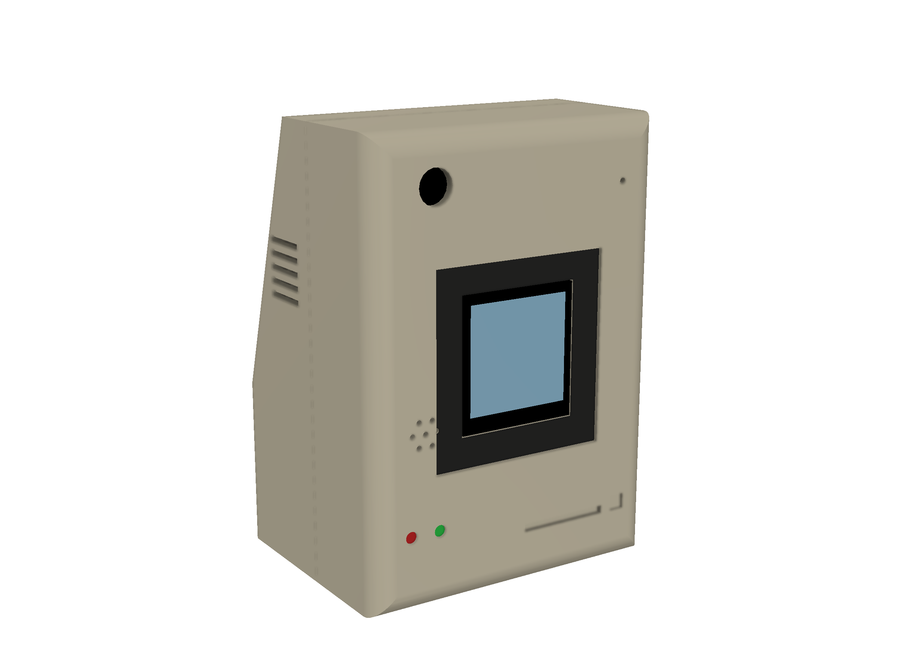
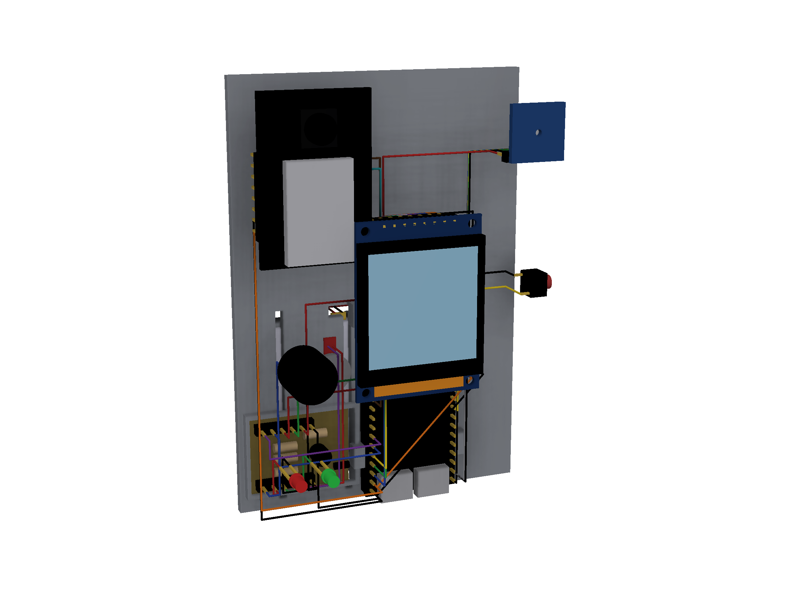
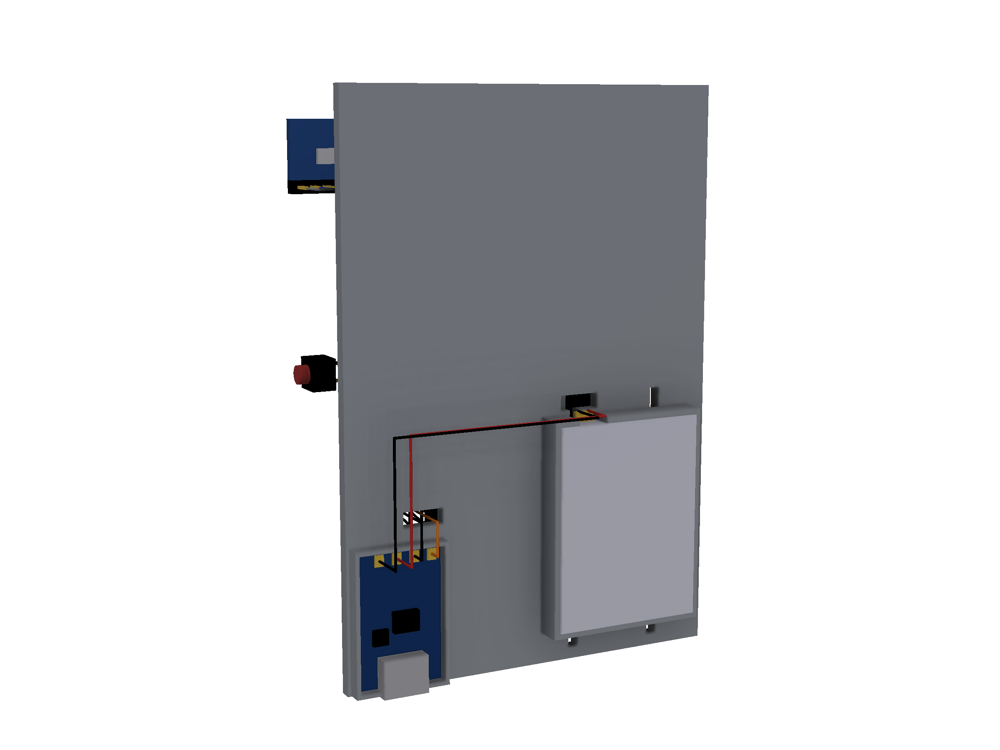

# AccessiSound v2: enclosure, layout and wiring

This folder holds a CAD reconstruction of the v2 device: a custom enclosure
in the proportions of a vintage Macintosh 128K, with the boards laid out
inside and every wire drawn. The original v2 design files are lost, so this
is a **reconstruction from the repo docs, your description of the build, and
looked-up component dimensions**. It has not been printed or assembled.






## Files

| File | What it is |
|---|---|
| `accessisound_v2_assembly.f3d` | Fusion 360 archive: the full assembly, one component per part, editable |
| `accessisound_v2_assembly.step` | Same assembly as STEP, for any other CAD program |
| `stl/enclosure_front.stl` | Front shell, posed face down for printing |
| `stl/enclosure_back.stl` | Back shell, posed open side down for printing |
| `stl/mount_plate.stl` | Internal mounting plate |
| `stl/print_plate_layout.stl` | All three parts arranged on one build plate (251 x 116 mm, fits a 256 mm bed) |

All STL files are in millimetres and were checked to be closed solids
(no open or shared edges). Supports are needed for the back shell and the
plate; check the orientation in your slicer. Nothing here has been test
printed. The shells meet at a butt joint with a 2 mm alignment lip on the
back shell: glue it, or add your own screw bosses.

## Size and layout

Outside: 82 wide x 116 tall x 64 deep mm. Front face on the left of the
diagram, parts stacked front to back:

```
front wall 2.4 | display + camera + mic | wire zone | DevKit | plate | battery + charger
```

- Front wall: recessed dark bezel, display window, camera window (top left),
  mic port (top right), buzzer grille, two status LED holes, a decorative
  floppy-style slot, a mute button hole in the right wall.
- Bottom wall: USB-C openings for the DevKit (flashing) and the charger.
- Back shell: side vents, sloped rear like the Mac 128K.
- Mounting plate: side blocks that locate the DevKit, pockets for the
  charger, battery and driver board, two strap slots, two wire slots.

## Parts and dimensions

**Verified** means checked against a source in this session. **Assumed**
means a typical value I could not confirm, so measure yours before printing.

| Part | Size used (mm) | Status |
|---|---|---|
| ESP32-S3-DevKitC-1 v1.1 | 25.4 x 62.86 board | **Verified** from Espressif's official DXF (`dl.espressif.com/dl/schematics/esp_idf/DXF_ESP32-S3-DevKitC-1_V1.1_20220429.dxf`). Third-party pages round this to 70 x 28. Header pitch 2.54 confirmed in the same file; row spacing measures about 22.7 to 22.9 (0.9 in nominal), 22 pins each. Board thickness 1.6 and module height 3.1 assumed. |
| ESP32-CAM (AI-Thinker) | 40.5 x 27 x 4.5 board | **Verified** from 2 independent listings. Camera lens position and lens height above the board (5 mm) assumed. |
| 1.54 inch TFT, 240x240, ST7789 | PCB 43.5 x 32, glass 31.7 x 34.3 | **Verified** against your two photos, see below. Thickness (glass 2.6 + PCB 1.0) assumed. |
| INMP441 microphone board | 14 x 14 | Assumed |
| TP4056 charger, USB-C | 26 x 17 | Assumed (common module size) |
| LiPo cell | 40 x 30 x 6 (a 603040 class cell) | Assumed. Your exact cell is not specified anywhere. |
| Passive buzzer | 12 dia x 9.5 | Assumed |
| Coin vibration motor | 10 dia x 2.7 | Assumed |
| 3 mm LEDs, 6 mm tact switch | standard | Assumed |

### How the display was checked against the photos

The Amazon listing page (`amazon.com/dp/B0GVYMJVWH`, sold as "AITRIP 1.54 inch
TFT ST7789 240x240") could only be fetched as a title, so its spec table
was not machine-readable. The two product photos were measured instead:

- PCB 779 x 1061 px in the pin-definition photo gives an aspect ratio of
  1.362. The listed 43.5 x 32 mm gives 1.359. They agree.
- Header pitch in the photo: 2.56 mm at the photo's scale (expected 2.54).
- Glass outline measured at 31.7 x 34.3 mm, mounting holes 27.2 x 39.2 mm
  apart and 2.5 mm in from the side edges, 8-pin header centred 1.3 mm
  below the PCB top edge. Pin order left to right: GND VCC SCL SDA RST DC
  CS BL, matching the listing's pin table.
- **The lit picture in both photos is wider (30.8 mm) than a 1.54 inch
  240x240 panel can be** (27.7 mm square from the diagonal), so the images
  are marketing composites and not a measurement of the active area. The
  model uses 27.72 mm.

## Wiring

Wires in the model are illustrative routes (each on its own depth plane),
not a routed harness. The connections are what matters.

### A. Taken from `firmware/src/main.cpp` (real pin numbers in the repo code)

| From | To |
|---|---|
| Mic WS | GPIO 42 |
| Mic SCK | GPIO 41 |
| Mic SD | GPIO 2 |
| Mic VDD | 3V3 |
| Mic GND, mic L/R | GND (L/R low = left channel, which the firmware reads) |
| GPIO 10 | 1 kΩ to the base of an NPN transistor (2N2222) |
| Transistor emitter | GND |
| Transistor collector | motor minus; motor plus to 3V3 |
| Diode (1N4148) | across the motor, cathode to 3V3 (flyback) |
| GPIO 11 | 100 Ω to the buzzer plus; buzzer minus to GND |
| GPIO 38 | 220 Ω to the red LED anode; cathode to GND |
| GPIO 39 | 220 Ω to the green LED anode; cathode to GND |
| GPIO 0 | mute (the DevKit BOOT button; the model adds an external button in parallel) |

### B. Proposed by me for the parts the repo firmware does not drive

These parts are in your v2 build but no code in this repo talks to them, so
these pins are my choice, picked to avoid the strapping pins (0, 3, 45, 46),
USB (19, 20) and the pins in table A. **They are not your real wiring.**
Change them freely.

| Part | Wire | ESP32-S3 |
|---|---|---|
| Display | GND, VCC | GND, 3V3 |
| Display | SCL, SDA | GPIO 12, GPIO 13 |
| Display | CS, DC, RST | GPIO 14, GPIO 15, GPIO 16 |
| Display | BL | GPIO 17 |
| ESP32-CAM | 5V, GND | 5V pin, GND |
| ESP32-CAM | U0R (GPIO 3) from ESP32-S3 TX | GPIO 18 |
| ESP32-CAM | U0T (GPIO 1) to ESP32-S3 RX | GPIO 8 |
| Charger | OUT+ / OUT- | 5V pin / GND (see the power warning) |
| Charger | B+ / B- | LiPo red / black |

**Power warning.** A TP4056 outputs the battery voltage (3.0 to 4.2 V),
not 5 V. The DevKit's 5V pin needs about 5 V, so a 5 V boost converter (or
a charger-plus-boost module) has to sit between the charger output and the
DevKit. The model draws a direct wire and labels it "boost not modeled",
because your notes do not say what you used.

**ESP32-CAM header order.** The pin order used for the camera header
(5V, GND, IO12, IO13, IO15, IO14, IO2, IO4 on one side; 3V3, IO16, IO0, GND,
VCC, U0R, U0T, GND on the other) is the commonly published AI-Thinker order
and was not checked against a board in hand. The INMP441 pin order also
differs between breakout boards; follow your board's silkscreen.

## Fixes made to the older wiring notes

- The old parts list included a 1 kΩ resistor that the wiring text never used,
  and the wiring text put a 100 Ω resistor on the transistor base. From 3.3 V
  that is about 26 mA out of a GPIO, over what an ESP32-S3 pin should source.
  The base resistor is now 1 kΩ, which uses the listed part.
- A motor driven through a transistor needs a flyback diode across the motor.
  The old notes had none. A 1N4148 is added.
